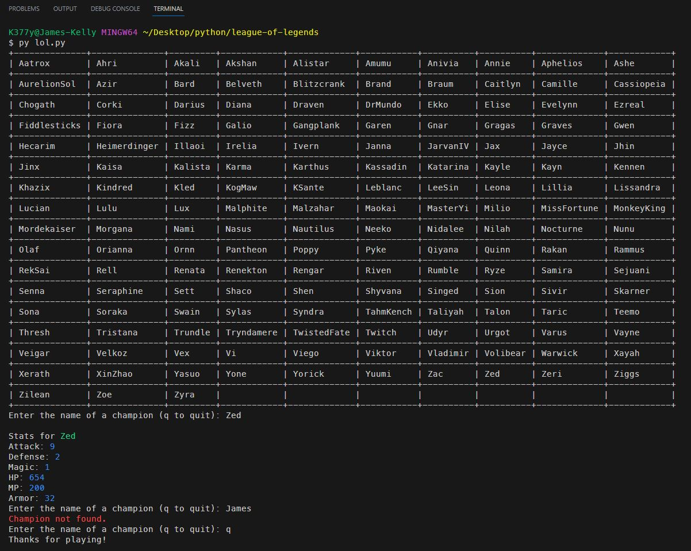
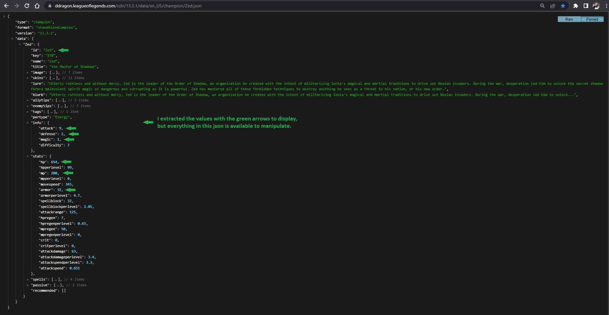

# League of Legends API

 

### I love this API from RIOT games (no api key needed).
http://ddragon.leagueoflegends.com/cdn/13.10.1/data/en_US/champion.json

## *Description*
This is a simple Python app that uses the requests module to query the League of Legends API for champion data. The app then parses the JSON response and displays the data in a table. The user can then choose a champion from the table and the app will query the api for the champion's stats and display them. I am considering using this method to create a card game project in a future portfolio piece.
 
 

### ***Some notes about the Python requests module:*** 
 - Allows for the use of sending http methods such as 'GET', 'POST', 'PUT', 'DELETE', etc. The response from the server can be accessed through the 'Response' object. 
 - This module allows us to pass query parameters and request data. 
 - You can handle errors and exceptions that may occur during the request by checking the response status code. 

### ***Some notes about the Python tabulate module:*** 
 - The tabulate module provides a convenient way to create formatted tables from tabular data. 
 - The module supports various table formats, such as plain text, simple grids, Markdown, HTML, and more. 
 - The module accepts data in different formats, including lists of lists, dictionaries, and pandas DataFrames. 

### ***Some notes about the Python f-strings:*** 
 - The f-string is basically the Javascript equivalent of a template literal (created with backticks) which allows the embedding of expressions within strings. 

 

## *Installation & Usage*
To install this app, simply clone the repository and run the `lol.py` file in your terminal.
 
When prompted: 
 - Choose a champion and type their name ***AS IT APPEARS*** on the table.
  

 
 

### The api response returns 162 champions (although, I'm pretty sure there are 163 in the table ~*shrug*~)

 

### If you type a champion name, it queries the api for the champion_id (the name from the table) and returns the queried champion's stats

 

## *Questions*
<h3>Portfolio:&emsp;<a href="https://jk377y.dev" target="_blank">https://jk377y.dev</a></h3>
<h3>Email:&emsp;<a href="mailto:jk377y@gmail.com" target="_blank">jk377y@gmail.com</a></h3>
<h3>LinkedIn:&emsp;<a href="https://www.linkedin.com/in/james-kelly-software-developer/" target="_blank">https://www.linkedin.com/in/james-kelly-software-developer/</a></h3>
<h3>GitHub:&emsp;<a href="https://github.com/jk377y" target="_blank">https://github.com/jk377y</a></h3>
 

## *License*

 Copyright (c) 2023 James Kelly
 Information on this license can be found at: (https://opensource.org/licenses/MIT)
 
 
<h2>This application is not endorsed by Riot Games and does not reflect the views or opinions of Riot Games or anyone officially involved in producing or managing Riot Games properties. Riot Games and all associated properties are trademarks or registered trademarks of Riot Games, Inc</h2>